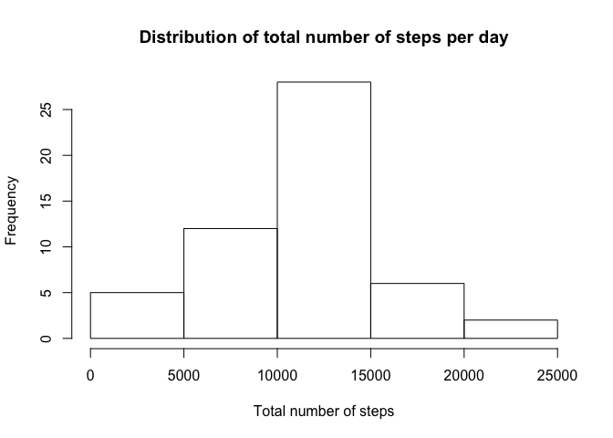
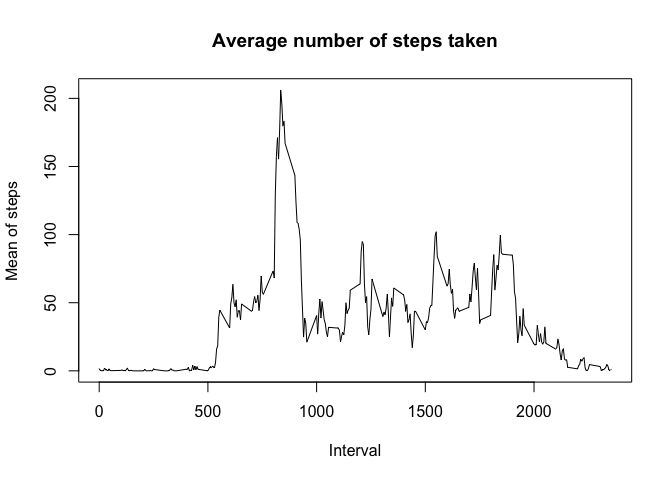
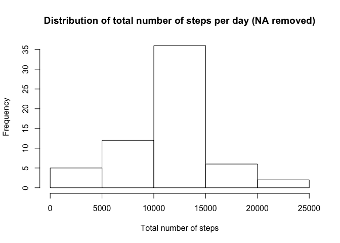
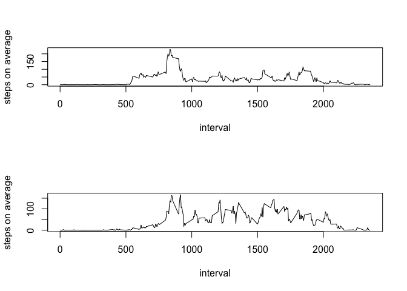

Reproducible research - peer graded W2 assignment
================

# 1\. Reading in the dataset and preparing the data

``` r
library("data.table")
```

``` r
zip_url <- "https://d396qusza40orc.cloudfront.net/repdata%2Fdata%2Factivity.zip"
temp <- tempfile()
download.file(zip_url,temp)
activity_ds <- read.csv(unz(temp, "activity.csv"))
activity_ds <- setDT(activity_ds)
```

# 2\. Histogram of the total number of steps taken each day

## 2.1 Calculating the total number of steps taken per day

``` r
total_num_of_steps <- activity_ds[,.(sum_of_steps = sum(steps)),date]
total_num_of_steps
```

    ##           date sum_of_steps
    ##  1: 2012-10-01           NA
    ##  2: 2012-10-02          126
    ##  3: 2012-10-03        11352
    ##  4: 2012-10-04        12116
    ##  5: 2012-10-05        13294
    ##  6: 2012-10-06        15420
    ##  7: 2012-10-07        11015
    ##  8: 2012-10-08           NA
    ##  9: 2012-10-09        12811
    ## 10: 2012-10-10         9900
    ## 11: 2012-10-11        10304
    ## 12: 2012-10-12        17382
    ## 13: 2012-10-13        12426
    ## 14: 2012-10-14        15098
    ## 15: 2012-10-15        10139
    ## 16: 2012-10-16        15084
    ## 17: 2012-10-17        13452
    ## 18: 2012-10-18        10056
    ## 19: 2012-10-19        11829
    ## 20: 2012-10-20        10395
    ## 21: 2012-10-21         8821
    ## 22: 2012-10-22        13460
    ## 23: 2012-10-23         8918
    ## 24: 2012-10-24         8355
    ## 25: 2012-10-25         2492
    ## 26: 2012-10-26         6778
    ## 27: 2012-10-27        10119
    ## 28: 2012-10-28        11458
    ## 29: 2012-10-29         5018
    ## 30: 2012-10-30         9819
    ## 31: 2012-10-31        15414
    ## 32: 2012-11-01           NA
    ## 33: 2012-11-02        10600
    ## 34: 2012-11-03        10571
    ## 35: 2012-11-04           NA
    ## 36: 2012-11-05        10439
    ## 37: 2012-11-06         8334
    ## 38: 2012-11-07        12883
    ## 39: 2012-11-08         3219
    ## 40: 2012-11-09           NA
    ## 41: 2012-11-10           NA
    ## 42: 2012-11-11        12608
    ## 43: 2012-11-12        10765
    ## 44: 2012-11-13         7336
    ## 45: 2012-11-14           NA
    ## 46: 2012-11-15           41
    ## 47: 2012-11-16         5441
    ## 48: 2012-11-17        14339
    ## 49: 2012-11-18        15110
    ## 50: 2012-11-19         8841
    ## 51: 2012-11-20         4472
    ## 52: 2012-11-21        12787
    ## 53: 2012-11-22        20427
    ## 54: 2012-11-23        21194
    ## 55: 2012-11-24        14478
    ## 56: 2012-11-25        11834
    ## 57: 2012-11-26        11162
    ## 58: 2012-11-27        13646
    ## 59: 2012-11-28        10183
    ## 60: 2012-11-29         7047
    ## 61: 2012-11-30           NA
    ##           date sum_of_steps

## 2.2 Building histogram of the total number of steps taken each day

``` r
hist(total_num_of_steps$sum_of_steps, 
     main = "Distribution of total number of steps per day",
     xlab = "Total number of steps")
```

<!-- -->

# 3\. Calculating the mean and median of the total number of steps taken per day

``` r
mean_and_median_num_of_steps <- activity_ds[,.(mean_of_steps = mean(steps), median_of_steps = median(steps)),date]
mean_and_median_num_of_steps
```

    ##           date mean_of_steps median_of_steps
    ##  1: 2012-10-01            NA              NA
    ##  2: 2012-10-02     0.4375000               0
    ##  3: 2012-10-03    39.4166667               0
    ##  4: 2012-10-04    42.0694444               0
    ##  5: 2012-10-05    46.1597222               0
    ##  6: 2012-10-06    53.5416667               0
    ##  7: 2012-10-07    38.2465278               0
    ##  8: 2012-10-08            NA              NA
    ##  9: 2012-10-09    44.4826389               0
    ## 10: 2012-10-10    34.3750000               0
    ## 11: 2012-10-11    35.7777778               0
    ## 12: 2012-10-12    60.3541667               0
    ## 13: 2012-10-13    43.1458333               0
    ## 14: 2012-10-14    52.4236111               0
    ## 15: 2012-10-15    35.2048611               0
    ## 16: 2012-10-16    52.3750000               0
    ## 17: 2012-10-17    46.7083333               0
    ## 18: 2012-10-18    34.9166667               0
    ## 19: 2012-10-19    41.0729167               0
    ## 20: 2012-10-20    36.0937500               0
    ## 21: 2012-10-21    30.6284722               0
    ## 22: 2012-10-22    46.7361111               0
    ## 23: 2012-10-23    30.9652778               0
    ## 24: 2012-10-24    29.0104167               0
    ## 25: 2012-10-25     8.6527778               0
    ## 26: 2012-10-26    23.5347222               0
    ## 27: 2012-10-27    35.1354167               0
    ## 28: 2012-10-28    39.7847222               0
    ## 29: 2012-10-29    17.4236111               0
    ## 30: 2012-10-30    34.0937500               0
    ## 31: 2012-10-31    53.5208333               0
    ## 32: 2012-11-01            NA              NA
    ## 33: 2012-11-02    36.8055556               0
    ## 34: 2012-11-03    36.7048611               0
    ## 35: 2012-11-04            NA              NA
    ## 36: 2012-11-05    36.2465278               0
    ## 37: 2012-11-06    28.9375000               0
    ## 38: 2012-11-07    44.7326389               0
    ## 39: 2012-11-08    11.1770833               0
    ## 40: 2012-11-09            NA              NA
    ## 41: 2012-11-10            NA              NA
    ## 42: 2012-11-11    43.7777778               0
    ## 43: 2012-11-12    37.3784722               0
    ## 44: 2012-11-13    25.4722222               0
    ## 45: 2012-11-14            NA              NA
    ## 46: 2012-11-15     0.1423611               0
    ## 47: 2012-11-16    18.8923611               0
    ## 48: 2012-11-17    49.7881944               0
    ## 49: 2012-11-18    52.4652778               0
    ## 50: 2012-11-19    30.6979167               0
    ## 51: 2012-11-20    15.5277778               0
    ## 52: 2012-11-21    44.3993056               0
    ## 53: 2012-11-22    70.9270833               0
    ## 54: 2012-11-23    73.5902778               0
    ## 55: 2012-11-24    50.2708333               0
    ## 56: 2012-11-25    41.0902778               0
    ## 57: 2012-11-26    38.7569444               0
    ## 58: 2012-11-27    47.3819444               0
    ## 59: 2012-11-28    35.3576389               0
    ## 60: 2012-11-29    24.4687500               0
    ## 61: 2012-11-30            NA              NA
    ##           date mean_of_steps median_of_steps

``` r
mean_steps_across_all_days <- mean(total_num_of_steps$sum_of_steps,na.rm = TRUE)
mean_steps_across_all_days # 10766.19
```

    ## [1] 10766.19

``` r
median_steps_across_all_days <- median(total_num_of_steps$sum_of_steps,na.rm = TRUE)
median_steps_across_all_days # 10765
```

    ## [1] 10765

# 4\. Time series plot of the average number of steps taken

``` r
mean_of_steps_across_intervals <- 
  activity_ds[,.(mean_of_steps = mean(steps,na.rm = TRUE)), interval]

plot(mean_of_steps_across_intervals$interval,
     mean_of_steps_across_intervals$mean_of_steps, type = "l",
     main = "Average number of steps taken",
     xlab = "Interval", ylab = "Mean of steps")
```

<!-- -->

# 5\. Determining the 5-minute interval that, on average, contains the maximum number of steps

``` r
mean_of_steps_across_intervals[which.max(mean_of_steps_across_intervals$mean_of_steps)]
```

    ##    interval mean_of_steps
    ## 1:      835      206.1698

# 6\. Code to describe and show a strategy for imputing missing data

## 6.1 Number of missing values in the dataset

``` r
sum(is.na(activity_ds$steps))
```

    ## [1] 2304

## 6.2 Imputting missing values by 5 min interval mean values

``` r
merged_activity_ds <- merge(activity_ds, mean_of_steps_across_intervals,
                            all.x = TRUE,
                            by.x = "interval",
                            by.y = "interval")

merged_activity_ds[,steps := ifelse(is.na(steps),mean_of_steps,steps)]
```

## 6.3 Creating a new dataset that is equal to the original dataset but with the missing data filled in.

``` r
activity_ds_filled <- merged_activity_ds[,c("steps", "date", "interval")]
```

## 6.4 Making a histogram on imputted data

``` r
total_num_of_steps_filled <- activity_ds_filled[,.(sum_of_steps = sum(steps)),date]
```

# 7\. Building histogram of the total number of steps taken each day after missing values are imputed

``` r
hist(total_num_of_steps_filled$sum_of_steps, 
     main = "Distribution of total number of steps per day (NA removed)",
     xlab = "Total number of steps")
```

<!-- -->

``` r
mean_steps_across_all_days_noNA <- mean(total_num_of_steps_filled$sum_of_steps,na.rm = TRUE)
mean_steps_across_all_days_noNA # 10766.19
```

    ## [1] 10766.19

``` r
median_steps_across_all_days_noNA <- median(total_num_of_steps_filled$sum_of_steps,na.rm = TRUE)
median_steps_across_all_days_noNA # 10766.19
```

    ## [1] 10766.19

As we see, median recalculated on inputted data is higher +1.19 steps
comparing with original noninputted data. Mean stays the
same.

# 8\. Panel plot comparing the average number of steps taken per 5-minute interval across weekdays and weekends

## 8.1 Creating weekday/weekend var

``` r
activity_ds_filled[,day_of_week := ifelse(
  weekdays(as.Date(date)) == "Saturday" | weekdays(as.Date(date)) == "Sunday", "weekend", "weekday")]

table(activity_ds_filled$day_of_week)
```

    ## 
    ## weekday weekend 
    ##   12960    4608

## 8.2 Creating panel plots

``` r
mean_of_steps_weekday <- 
  activity_ds_filled[day_of_week == "weekday",.(mean_of_steps = mean(steps)), interval]

mean_of_steps_weekend <- 
  activity_ds_filled[day_of_week == "weekend",.(mean_of_steps = mean(steps)), interval]

par(mfrow=c(2,1))

plot(mean_of_steps_weekday$interval,
     mean_of_steps_weekday$mean_of_steps, type = "l",
     xlab = "interval", ylab = "steps on average")

plot(mean_of_steps_weekend$interval,
     mean_of_steps_weekend$mean_of_steps, type = "l",
     xlab = "interval", ylab = "steps on average")
```

<!-- -->

As we could see, activity during weekends starts more later than in
working days, and is a bit more intensive during the whole weekend days
and evenings.
